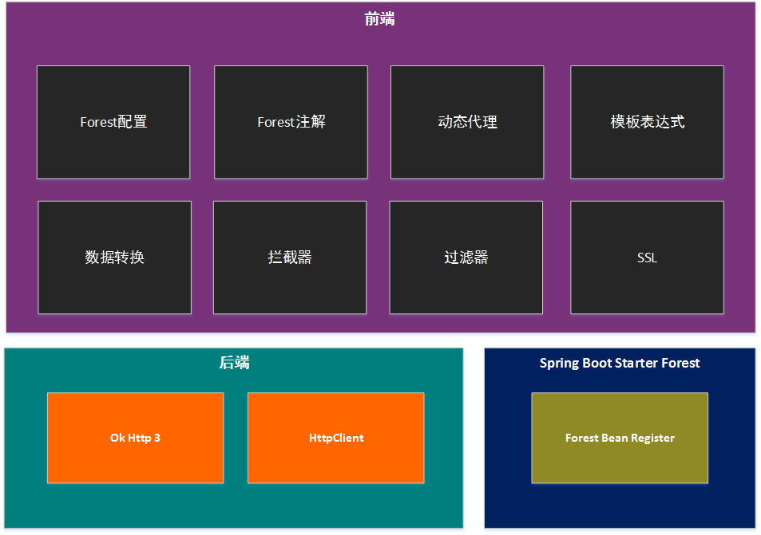

# 一. 新手介绍

## 什么是Forest？

Forest是一个开源的Java HTTP客户端框架，它能够将HTTP的所有请求信息（包括URL、Header以及Body等信息）绑定到您自定义的Interface方法上，能够通过调用本地接口方法的方式发送HTTP请求。

## 为什么使用Forest?

使用Forest就像使用类似Dubbo那样的RPC框架一样，只需要定义接口，调用接口即可，不必关心具体发送HTTP请求的细节。同时将HTTP请求信息与业务代码解耦，方便您统一管理大量HTTP的URL、Header等信息。而请求的调用方完全不必在意HTTP的具体内容，即使该HTTP请求信息发生变更，大多数情况也不需要修改调用发送请求的代码。

## Forest如何使用?

Forest不需要您编写具体的HTTP调用过程，只需要您定义一个接口，然后通过Forest注解将HTTP请求的信息添加到接口的方法上即可。请求发送方通过调用您定义的接口便能自动发送请求和接受请求的响应。

## Forest的工作原理

Forest会将您定义好的接口通过动态代理的方式生成一个具体的实现类，然后组织、验证HTTP请求信息，绑定动态数据，转换数据形式，SSL验证签名，调用后端HTTP API(httpclient等API)执行实际请求，等待响应，失败重试，转换响应数据到Java类型等脏活累活都由这动态代理的实现类给包了。
请求方发送方调用这个接口时，实际上就是在调用这个干脏活累活的实现类。


## Forest的架构



我们讲HTTP发送请求的过程分为前端部分和后端部分，Forest本身是处理前端过程的框架，是对后端HTTP API框架的进一步封装。

<b>前端部分：</b>

1. Forest配置： 负责管理HTTP发送请求所需的配置。
2. Forest注解： 用于定义HTTP发送请求的所有相关信息，一般定义在interface上和其方法上。
3. 动态代理： 用户定义好的HTTP请求的`interface`将通过动态代理产生实际执行发送请求过程的代理类。
4. 模板表达式： 模板表达式可以嵌入在几乎所有的HTTP请求参数定义中，它能够将用户通过参数或全局变量传入的数据动态绑定到HTTP请求信息中。
5. 数据转换： 此模块将字符串数据和`JSON`或`XML`形式数据进行互转。目前JSON转换器支持`Jackson`、`Fastjson`、`Gson`三种，XML支持`JAXB`一种。
6. 拦截器： 用户可以自定义拦截器，拦截指定的一个或一批请求的开始、成功返回数据、失败、完成等生命周期中的各个环节，以插入自定义的逻辑进行处理。
7. 过滤器： 用于动态过滤和处理传入HTTP请求的相关数据。
8. SSL： Forest支持单向和双向验证的HTTPS请求，此模块用于处理SSL相关协议的内容。

<b>后端部分：</b>

后端为实际执行HTTP请求发送过程的第三方HTTP API，目前支持`okHttp3`和`httpclient`两种后端API。

<b>Spring Boot Starter Forest:</b>

提供对`Spring Boot`的支持


## 对应的Java版本

Forest 1.0.x和Forest 1.1.x基于JDK 1.7, Forest 1.2.x基于JDK 1.8

# 二. 安装

## 2.1 在Spring Boot项目中安装

若您的项目基于`Spring Boot`，那只要添加下面一个maven依赖便可。

```xml
<dependency>
    <groupId>com.dtflys.forest</groupId>
    <artifactId>spring-boot-starter-forest</artifactId>
    <version>1.2.0</version>
</dependency>
```
最新版本为<font color=red>*1.2.0*</font>，为稳定版本


## 2.2 在普通项目中安装

先添加后端HTTP API的依赖：`okhttp3` 或 `httpclient`.
以及JSON解析框架：`Jackson`、`Fastjson`或`Gson`
```xml
<dependency>
  <groupId>com.squareup.okhttp3</groupId>
  <artifactId>okhttp</artifactId>
  <version>3.3.0</version>
</dependency>

<dependency>
    <groupId>com.alibaba</groupId>
    <artifactId>fastjson</artifactId>
    <version>1.2.47</version>
</dependency>
```

然后添加Forest核心包依赖

```xml
<dependency>
    <groupId>com.dtflys.forest</groupId>
    <artifactId>forest-core</artifactId>
    <version>1.2.0</version>
</dependency>
```
最新版本为<font color=red>*1.2.0*</font>，为稳定版本

# 三. 配置

## 3.1 在Spring Boot项目中配置

若您的项目依赖`Spring Boot`，并加入了`spring-boot-starter-forest`依赖，就可以通过application.yml/application.properties方式定义配置。

### 3.1.1 配置forest启动开关
在`application.yml`中设置`forest.enabled`为`true`，便能开启Forest。若设为false，`Spring Boot`便不会再扫描Forest。

```yaml
forest:
  enabled: true
```

### 3.1.2 配置后端HTTP API

```yaml
forest:
  enabled: true       
  backend: okhttp3         # 配置后端HTTP API为 okhttp3
```

目前Forest支持`okhttp3`和`httpclient`两种后端HTTP API，若不配置该属性，默认为`okhttp3`.
当然，您也可以改为`httpclient`

```yaml
forest:
  enabled: true       
  backend: httpclient         # 配置后端HTTP API为 httpclient
```

### 3.1.3 配置Bean ID 
Forest允许您在yaml文件中配置Bean Id，它对应着`ForestConfiguration`对象在Spring上下文中的Bean名称。

```yaml
forest:
  enabled: true
  bean-id: config0            # 在spring上下文中bean的id，默认值为forestConfiguration
```

然后便可以在Spring中通过Bean的名称引用到它

```java
@Resource(name = "config0")
private ForestConfiguration config0;
```

### 3.1.4 全局基本配置

在`application.yaml` / `application.properties`中配置的HTTP基本参数

```yaml
forest:
  enabled: true                           # forest开关
  bean-id: config0                        # 在spring上下文中bean的id, 默认值为forestConfiguration
  backend: okhttp3                        # 后端HTTP API： okhttp3
  max-connections: 1000                   # 连接池最大连接数，默认值为500
  max-route-connections: 500              # 每个路由的最大连接数，默认值为500
  timeout: 3000                           # 请求超时时间，单位为毫秒, 默认值为3000
  connect-timeout: 3000                   # 连接超时时间，单位为毫秒, 默认值为2000
  retry-count: 1                          # 请求失败后重试次数，默认为0次不重试
  ssl-protocol: SSLv3                     # 单向验证的HTTPS的默认SSL协议，默认为SSLv3
```

### 3.1.5 全局变量定义

Forest可以在`forest.variables`属性下自定义全局变量。

其中key为变量名，value为变量值。

全局变量可以在任何模板表达式中进行数据绑定。

```yaml
forest:
  enabled: true
  variables:
    username: foo
    userpwd: bar
```

## 3.2 在普通项目中配置

若您的项目不是`Spring Boot`项目，或者没有依赖`spring-boot-starter-forest`，可以通过下面方式定义Forest配置。

### 3.2.1 创建ForestConfiguration对象

`ForestConfiguration`为Forest的全局配置对象类，所有的Forest的全局基本配置信息由此类进行管理。

`ForestConfiguration`对象的创建方式：调用静态方法`ForestConfiguration.configuration()`，此方法会创建ForestConfiguration对象并初始化默认值。

```java
ForestConfiguration configuration = ForestConfiguration.configuration();
```

### 3.2.2 配置后端HTTP API

```java
configuration.setBackendName("okhttp3");
```

目前Forest支持`okhttp3`和`httpclient`两种后端HTTP API，若不配置该属性，默认为`okhttp3`。

当然，您也可以改为`httpclient`

```java
configuration.setBackendName("httpclient");
```

### 3.2.3 全局基本配置

```java
// 连接池最大连接数，默认值为500
configuration.setMaxConnections(123);
// 每个路由的最大连接数，默认值为500
configuration.setMaxRouteConnections(222);
// 请求超时时间，单位为毫秒, 默认值为3000
configuration.setTimeout(3000);
// 连接超时时间，单位为毫秒, 默认值为2000
configuration.setConnectTimeout(2000);
// 请求失败后重试次数，默认为0次不重试
configuration.setRetryCount(3);
// 单向验证的HTTPS的默认SSL协议，默认为SSLv3
configuration.setSslProtocol(SSLUtils.SSLv3);
```

### 3.2.4 全局变量定义

Forest可以通过`ForestConfiguration`对象的`setVariableValue`方法自定义全局变量。

其中第一个参数为变量名，第二个为变量值。

全局变量可以在任何模板表达式中进行数据绑定。

```java
ForestConfiguration configuration = ForestConfiguration.configuration();
...
configuration.setVariableValue("username", "foo");
configuration.setVariableValue("userpwd", "bar");
```

## 3.3 配置层级

上面介绍的`application.yml` / `application.properties`配置以及通过`ForestConfiguration`对象设置的配置都是全局配置。

除了全局配置，Forest还提供了接口配置和请求配置。

这三种配置的作用域和读取优先级各不相同。

作用域： 配置作用域指的是配置所影响的请求范围。

优先级： 优先级值的是是否优先读取该配置。比如您优先级最高`@Request`中定义了`timeout`为`500`，那么即便在全局配置中定了`timeout`为`1000`，最终该请求实际的`timeout`为优先级配置最高的`@Request`中定义的`500`。

具体的配置层级如图所示：


Forest的配置层级介绍：

1. 全局配置：针对全局所有请求，作用域最大，配置读取的优先级最小。

2. 接口配置： 作用域为某一个`interface`中定义的请求，读取的优先级最小。您可以通过在`interface`上修饰`@BaseRequest`注解进行配置。

3. 请求配置： 作用域为某一个具体的请求，读取的优先级最高。您可以在接口的方法上修饰`@Request`注解进行HTTP信息配置的定义。


# 四. 定义请求接口

在Forest基本配置好之后，就可以定义HTTP请求的接口了。

在Forest中，所有的HTTP请求信息都要绑定到某一个接口的方法上，不需要编写具体的代码去发送请求。请求发送方通过调用事先定义好HTTP请求信息的接口方法，自动去执行HTTP发送请求的过程，其具体发送请求信息就是该方法对应绑定的HTTP请求信息。

## 4.1 简单请求定义

创建一个`interface`，并用`@Request`注解修饰接口方法。

```java
public interface MyClient {

    @Request(url = "http://localhost:5000/hello")
    String simpleRequest();

}
```

通过`@Request`注解，将上面的`MyClient`接口中的`simpleRequest()`方法绑定了一个HTTP请求，
其URL为`http://localhost:5000/hello`
，并默认使用`GET`方式，且将请求响应的数据以`String`的方式返回给调用者。


## 4.2 稍复杂点的请求定义

```java
public interface MyClient {

    @Request(
            url = "http://localhost:5000/hello/user",
            headers = "Accept:text/plan"
    )
    String sendRequest(@DataParam("uname") String username);
}
```
上面的`sendRequest`方法绑定的HTTP请求，定义了URL信息，以及把`Accept:text/plan`加到了请求头中，
方法的参数`String username`绑定了注解`@DataParam("uname")`，它的作用是将调用者传入入参username时，自动将`username`的值加入到HTTP的请求参数`uname`中。

如果调用方代码如下所示：
```java
MyClient myClient;
...
myClient.sendRequest("foo");
```
这段调用所实际产生的HTTP请求如下：

    GET http://localhost:5000/hello/user?uname=foo
    HEADER:
        Accept:text/plan

## 4.3 改变HTTP Method

使用`POST`方式

```java
public interface MyClient {

    @Request(
            url = "http://localhost:5000/hello",
            type = "POST"
    )
    String simplePost();
}
```
如果上面代码所示，可以通过`@Request`注解的`type`参数指定HTTP请求的方式。

除了`GET`和`POST`，也可以指定成其他几种HTTP请求方式(`PUT`, `HEAD`, `OPTIONS`, `DELETE`)。

其中`type`属性的大小写不敏感，写成`POST`和`post`效果相同。

```java
public interface MyClient {

    // GET请求
    @Request(
            url = "http://localhost:5000/hello",
            type = "get"
    )
    String simpleGet();

    // POST请求
    @Request(
            url = "http://localhost:5000/hello",
            type = "post"
    )
    String simplePost();

    // PUT请求
    @Request(
            url = "http://localhost:5000/hello",
            type = "put"
    )
    String simplePut();

    // HEAD请求
    @Request(
            url = "http://localhost:5000/hello",
            type = "head"
    )
    String simpleHead();

    // Options请求
    @Request(
            url = "http://localhost:5000/hello",
            type = "options"
    )
    String simpleOptions();

    // Delete请求
    @Request(
            url = "http://localhost:5000/hello",
            type = "delete"
    )
    String simpleDelete();

}
```

## 4.4 设置HTTP请求头

在[4.2](##_42-稍复杂点的请求定义)的例子中，我们已经知道了可以通过`@Request`注解的`headers`属性设置一条HTTP请求头。

现在我们来看看如何添加多条请求头

其中`headers`属性接受的是一个字符串数组，在接受多个请求头信息时以以下形式填入请求头:

```java
{
    "请求头名称1:请求头值1",
    "请求头名称2:请求头值2",
    "请求头名称3:请求头值3",
    ...
 }
```

其中组数每一项都是一个字符串，每个字符串代表一个请求头。请求头的名称和值用`:`分割。

具体代码请看如下示例：

```java
public interface MyClient {

    @Request(
            url = "http://localhost:5000/hello/user",
            headers = {
                "Accept-Charset:utf-8",
                "Content-Type:text/plain"
            }
    )
    String multipleHeaders();
}
```

该接口调用后所实际产生的HTTP请求如下：

    GET http://localhost:5000/hello/user
    HEADER:
        Accept-Charset:utf-8
        Content-Type:text/plain


如果要每次请求传入不同的请求头内容，可以在`headers`属性的请求头定义中加入`数据绑定`(如何进行数据绑定请参见[[五 数据绑定](#五-数据绑定)])。

```java
public interface MyClient {

    @Request(
            url = "http://localhost:5000/hello/user",
            headers = {
                "Accept-Charset:${encoding}",
                "Content-Type:text/plain"
            }
    )
    String bindingHeader(@DataVariable("encoding") String encoding);
}
```

如果调用方代码如下所示：
```java
myClient.bindingHeader("gbk");
```

这段调用所实际产生的HTTP请求如下：

    GET http://localhost:5000/hello/user
    HEADER:
        Accept-Charset:gbk
        Content-Type:text/plain

## 4.5 data属性


# 五 数据绑定

上面已经介绍了如何创建可以发送HTTP请求的接口，并绑定到某个接口方法上，已经可以实现简单请求的发送和接受。

但问题是这些绑定的HTTP请求信息如URL和HEAD信息都是静态的不能动态改变，而我们在业务中大多数时候都需要动态地将数据传入到HTTP请求的各个部分（如URL、参数、HEAD、BODY等等），并发送到远端服务器。

这时候就需要`数据绑定`来实现这些功能，
Forest提供多种方式进行`数据绑定`。

## 4.1 参数序号绑定

您可以使用`${数字}`的方式引用对应顺序的参数，其中`${...}`是模板表达式的语法形式。

序号所对应的参数在接口方法调用时传入的值，会被自动绑定到`${数字}`所在的位置。

`注`：参数序号从`0`开始计数。

比如`${0}`表示的就是第一个参数，`${1}`表示的第二个参数，以此类推。

```java

@Request(
    url = "${0}/send?un=${1}&pw=${2}&da=${3}&sm=${4}",
    type = "get",
    dataType = "json"
)
public Map send(
    String base,
    String userName,
    String password,
    String phoneList,
    String content
);
```

如果调用方代码如下所示：

```java
myClient.send("http://localhost:8080", "DT", "123456", "123888888", "Hahaha");
```

实际产生的HTTP请求如下：

    GET http://localhost:8080/send?un=DT&pw=123456&da=123888888&sm=Hahaha


## 4.2 @DataParam参数绑定


```java

@Request(
    url = "${0}/send",
    type = "get",
    dataType = "json"
)
public Map send(
    String base,
    @DataParam("un") String userName,
    @DataParam("pw") String password,
    @DataParam("da") String phoneList,
    @DataParam("sm") String content
);
```

如果调用方代码如下所示：

```java
myClient.send("http://localhost:8080", "DT", "123456", "123888888", "Hahaha");
```

实际产生的HTTP请求如下：

    GET http://localhost:8080/send?un=DT&pw=123456&da=123888888&sm=Hahaha


## 4.3 @DataVariable参数绑定

在接口方法中定义的参数前加上`@DataVariable`注解并`value`中输入一个名称，便可以实现参数的`变量名`绑定。

`@DataVariable`注解的`value`的值便是该参数在Forest请求中对应的`变量名`。

意思就是在`@Request`的多个不同属性（`url`, `headers`, `data`）中通过`${变量名}`的模板表达式的语法形式引用之前在`@DataVariable`注解上定义的`变量名`，实际引用到的值就是调用该方法时传入该参数的实际值。

```java

@Request(
    url = "${base}/send?un=${un}&pw=${pw}&da=${da}&sm=${sm}",
    type = "get",
    dataType = "json"
)
public Map send(
    @DataVariable("base") String base,
    @DataVariable("un") String userName,
    @DataVariable("pw") String password,
    @DataVariable("da") String phoneList,
    @DataVariable("sm") String content
);
```

如果调用方代码如下所示：

```java
myClient.send("http://localhost:8080", "DT", "123456", "123888888", "Hahaha");
```

实际产生的HTTP请求如下：

    GET http://localhost:8080/send?un=DT&pw=123456&da=123888888&sm=Hahaha

## 4.4 全局变量绑定

若您已经定义好全局变量（关于如何定义全局变量请参见[Spring Boot全局变量定义](###_315-全局变量定义)，或[普通项目全局变量定义](###_324-全局变量定义)），那便可以直接在请求定义中绑定全局变量了。

若有全局变量：

    basetUrl: http://localhost:5050
    usrename: foo
    userpwd: bar
    phoneList: 123888888
 
```java

@Request(
        url = "${basetUrl}/send?un=${usrename}&pw=${userpwd}&da=${phoneList}&sm=${sm}",
        type = "get",
        dataType = "json"
)
Map testVar(@DataVariable("sm") String content);
```

如果调用方代码如下所示：

```java
myClient.send("Xxxxxx");
```

实际产生的HTTP请求如下：

    GET http://localhost:5050/send?un=foo&pw=bar&da=123888888&sm=Xxxxxx
    

# 六. 创建和获取请求接口实例

## 6.1 在Spring Boot项目中创建接口实例

若您已有定义好的Forest请求接口名为 `com.yoursite.client.MyClient`，

只要在`Spring Boot`的配置类或者启动类上加上`@ForestScan`注解，并在`basePackages`属性里填上远程接口的所在的包名

```java
@SpringBootApplication
@Configuration
@ForestScan(basePackages = "com.yoursite.client.MyClient")
public class MyApp {
 ...
}
```

Forest会扫描`@ForestScan`注解中`basePackages`属性指定的包下面所有的接口，然后会将符合条件的接口进行动态代理并注入到Spring的上下文中。

然后便能在其他代码中从Spring上下文注入接口实例

```java
@Component
public class MyService {
    @Autowired
    private MyClient myClient;
}
```

## 6.2 在普通项目中创建接口实例

通过`ForestConfiguration`的静态方法`createInstance`实例化接口。

```java
MyClient myClient = configuration.createInstance(MyClient.class);
```
